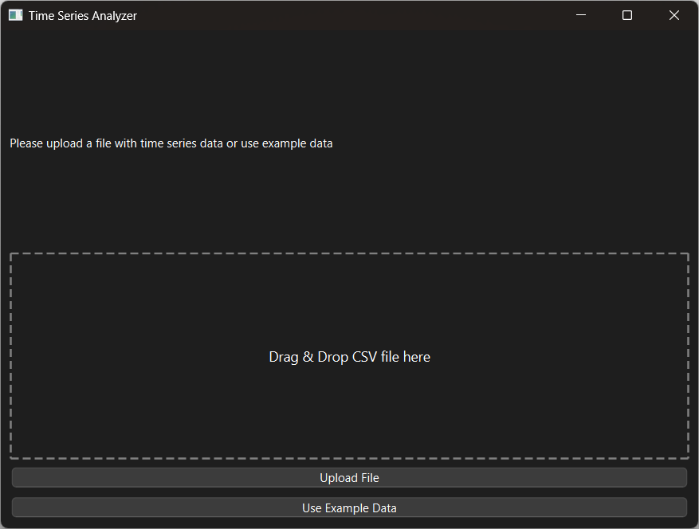
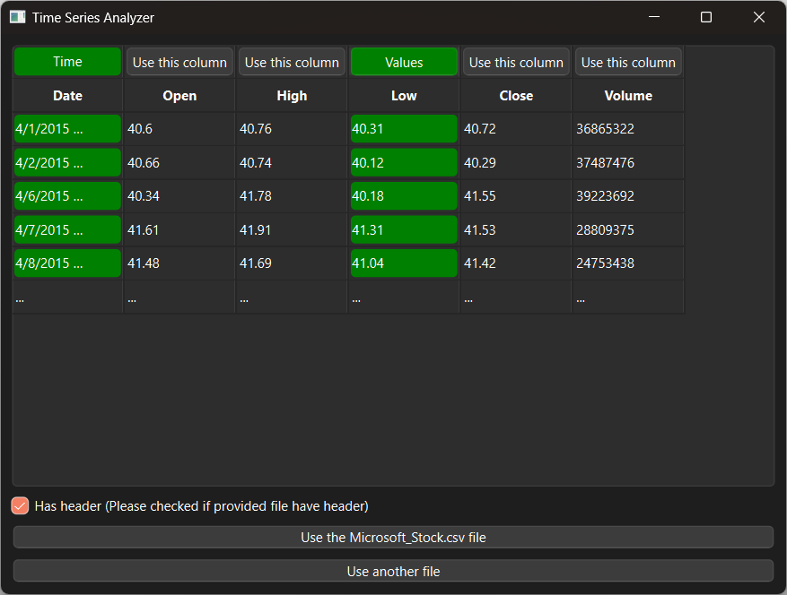
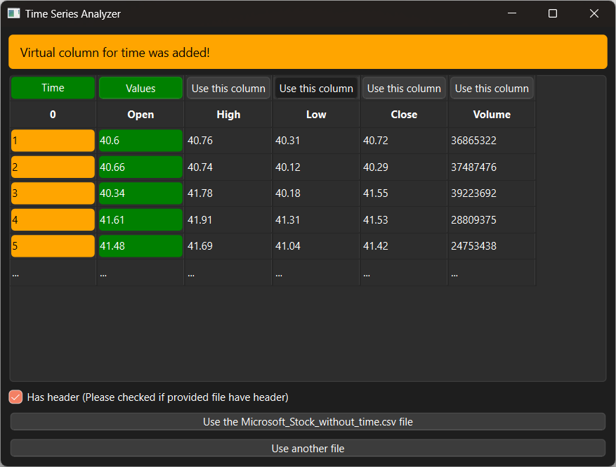
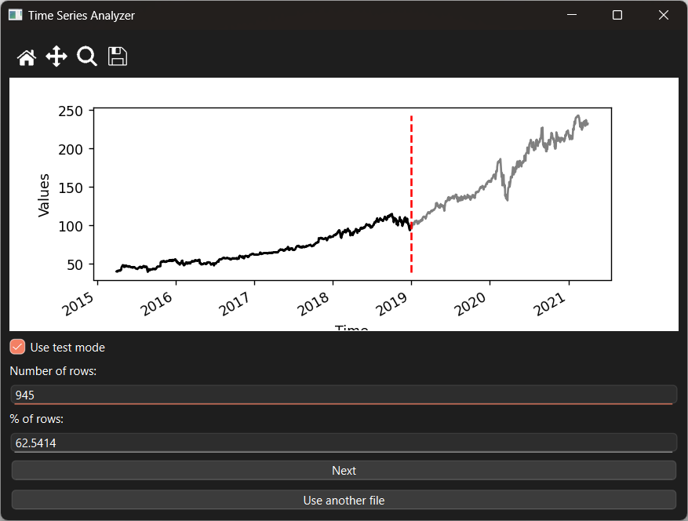
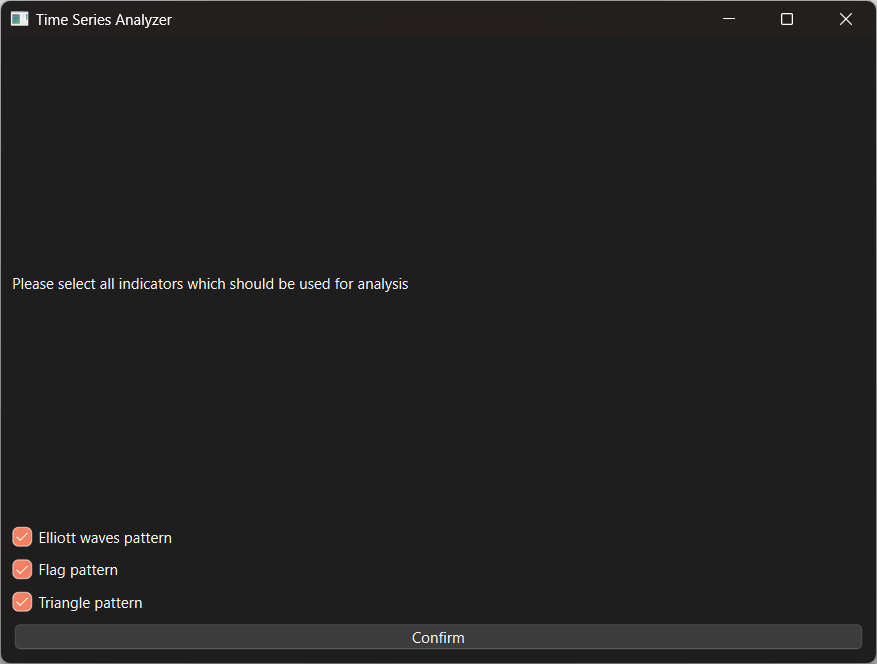
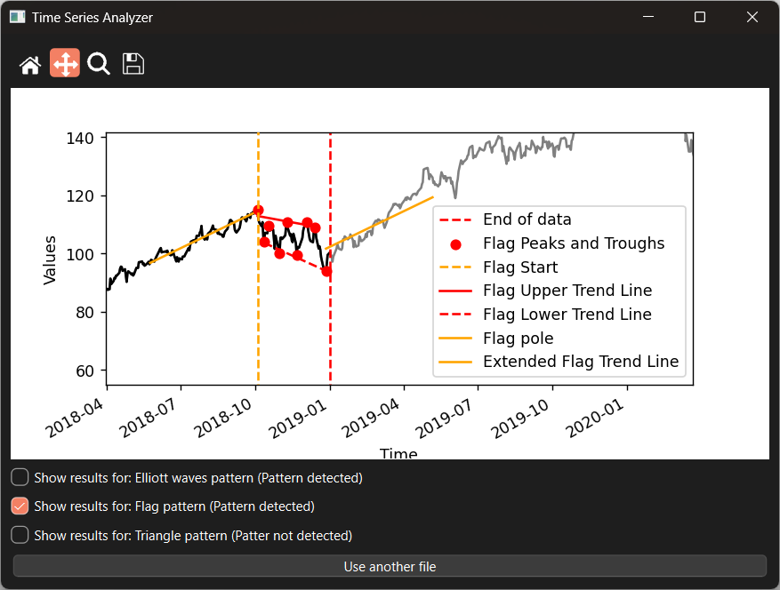

# Vitajte na projekte TSA (*Time Series Analyser*)

Tento projekt je zameraný na detekciu technických ukazovateľov v časových radoch a následnú predikciu budúceho smeru dát - *trendu*. Viac o používaní si môžete prečítať v časti *Používteľská príručka*.

### Spustenie projektu

Projekt sa spúšťa cez hlavný súbor `app.py`

### Štruktúra projektu

Projekt je rozdelený do viacero priečinkov, ktoré sú zodpovedné za konkrétne úlohy:

1. **Gui** - obsahuje súbory zodpovedné za používateľské rozhranie a vykreslovanie grafov.
1. **Data** - obsahuje súbor, ktorý popisuje ako sú štruktúrované dáta, s ktorými projekt pracuje a sú zdieľané naprieš všetkými technickými ukazovateľmi. Okrem toho je tu aj súbor `example.csv`, pomocou ktorého je možné aplikáciu testovať.
1. **Utils** - obsahuje súbor zodpovedný za prvotné spracovanie datového CSV súboru a taktiež jeho validáciu.
1. **Indicators** - tento priečinok obsahuje inteface pre technické indikátory a aj implementáciu konkrétnych ukazovateľov, konkrétne:
   1. *Trojuholníkový vzor*
   1. *Vlajkový vzor*
   1. *Vzor Elliottových vĺn*
   
    Aplíkacia zároveň funguje tak, že načítava všetky dostupné ukazovateľe v tomto priečinku, preto ak doplníme nový indikátor, ktorý je naimplementovaný správne, bude v aplikácii priamo dostupný.
1. **Ostatné súbory** - tu patrí hlavný súbor na spúšťanie `app.py` a `README.md`

### Používateľská príručka

1. Na prvej obrazovke si používateľ nahrá súbor, ktorý chce spracovať. K dispozícii je prechádzanie lokálnych súborov, ale aj *drag and drop* funkcionalita, na pohodlnejšie fungovanie. Okrem toho je tu stále možnosť si vybrať testové data, v prípade, že používateľ sa chce s aplikáciou zoznámiť a nemá iné data. Aplikácia podporuje prácu so súbormi s koncovkou `.csv`.
      
    
      
1. Po nahraní súboru sa používateľovi zobrazí obrazovka, kde vidí náhľad dát v súbore (prvých 5 riadkov). Zároveň prebehne aj validácia súboru a pokiaľ by bol súbor nesprávny, používateľ bude informovaný. Na tejto obrazovke je možné, pokiaľ je v súbore viacero stĺpcov, vybrať, ktorý z nich budeme analyzovať. Taktiež si vieme nastaviť, či priložený súbor obsahuje hlavičku alebo nie. Zaujímavá je aj funkcia, ktorá zabezpečí, že pokiaľ bol nahraný súbor bez stĺpca s časovými údajmi, takýto stĺpec automaticky vytvoríme.
      
    
      
    
      
1. Na ďalšej obrazovke používateľ môže vidieť svoje data zobrazené v grafe. Okrem toho má možnosť pustiť tzv. *testový mód*, ktorý mu dovolí si rozdeliť dataset na dve časti:
    1. Časť určenú na analýzu
    1. Časť určenú na verifikáciu 

    Toto je veľmi vhodné pokiaľ chceme overiť schopnosť algoritmov nájsť vybrané technické ukazovateľe a zároveň aj presnosť odhadov.
      
    
      
1. Po prechode do ďalšieho okna používateľ dostane na výber zoznam dostupných technických ukazovateľov, ktoré chce v dátach vyhľadať. Môže si tak buď zvoliť konkrétne alebo všetky ukazovatele.
      
    
      
1. Finálna obrazovka slúži na zobrazenie výsledkov nájdených technických ukazovateľov, ktoré sa zobrazia v grafe. Používateľ si môže zvoliť, ktoré výsledky sa mu zobrazia a ktoré nie.
      
    
      

